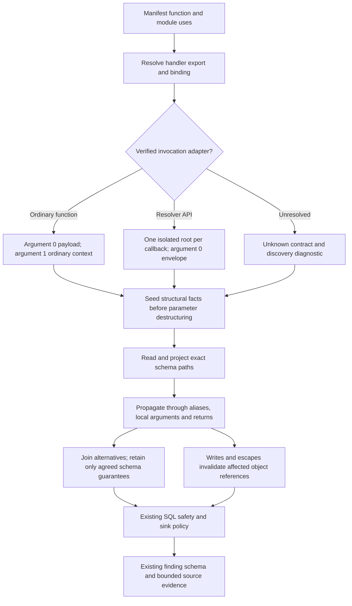

# Taint flow

`TaintDataflow
` is the opt-in forward analysis for scanners that need input trust
and source attribution. SQL injection is its first production consumer. The legacy
prototype-pollution, authorization, authentication, secret, and permission engines
retain their existing behavior.

## Value and policy contract

`FlowValue<F>` carries independently joined components:

- `TaintValue`: `Trusted < Unknown < Untrusted`, plus structured `SourceOrigin`s.
- `F: PolicyFacts`: the consuming scanner's interpretation of sink safety.
- `InputShape`: a finite policy schema, selected node/path, root identity, and
  invalidation state. A guarantee survives a join only when both alternatives
  support it; disagreement never manufactures a context object.
- `references`: possible input-object identities, retained even when a join loses
  its schema guarantee. This finite set is independent of the eight-origin cap.

`Trusted` is the join identity; an absent variable is not a trusted value. An
unreachable `FlowState::BOTTOM` differs from a reachable unknown value. Numeric
conversion and allowlist refinement update SQL safety without erasing input trust
or provenance. A SQL numeric-safe payload combined with an unresolved fragment
therefore remains Low, while an unsafe payload fragment remains High.

Origins identify a source rule, function, and argument or instruction site. They
contain no rendered paths or descriptions. `Origins` retains the least eight
unique keys, making bounded union associative, commutative, and idempotent.
Classification is computed independently, so truncation cannot downgrade trust.
Immutable origin sets are shared to keep CFG-state cloning inexpensive. Origin-only
changes count as state changes and participate in the fixed point.

## Adding sources and scanners

A `SourceDefinition` owns a stable unique ID, predicate, default classification,
and human-readable label. `FlowPolicy::sources` supplies scanner-specific rules;
these take precedence over the shared `FORGE_SOURCES` catalog. The policy can
override a rule's default classification through `source_classification`, without
repeating recognition or evidence labels. Add a source by adding one definition
and propagation/evidence tests, not a second match in a reporting traversal.

A scanner implements `PolicyFacts` and `FlowPolicy`, then chooses
`State = FlowState<Policy::Facts>` and `Dataflow = TaintDataflow<Policy>` on its
`Runner`. `NoFacts` is available when only generic trust matters. `classify_operand`
and `classify_variable` return the complete product value. Policies can supply
variable facts, operation facts, and guarded branch refinements. Sink matching,
severity, remediation, and rendering remain in the scanner.

The flow engine opts into joined function return states and caller-independent
callee visitation through `Dataflow` defaults inherited by `Runner`; legacy
engines retain their previous defaults. Use `run_checker_with_contract` for proven platform
entrypoint analysis: it resets analysis state before each entrypoint and resolver
callback while preserving the checker that merges findings. The compatibility
entry method `run_checker_isolated_resolvers` uses `InvocationContract::Unknown`;
it does not infer a contract from names. Other scanner engines retain their own
state and interpretation.

## Propagation and compatibility

Assignments are strong updates. CFG edges and function summaries join values;
branch refinements survive only if all reachable predecessors establish them.
Exact projected values precede conservative root summaries. Assignment aliases,
argument projections, returned objects, arrays, templates, concatenation, and phi
nodes carry trust, origins, and policy facts. Schema identity survives supported
reads, aliases, destructuring, local arguments, returns, and returned-object
fields. Computations and unresolved results do not retain a schema merely because
their inputs had one. Callees and
callers are revisited when their incoming state or return summaries change.

Binding references and assignment versions are grouped by their resolved `DefId`
within each body, using a lazy index over finalized IR. Display names do not
establish identity: shadowed declarations remain independent, and synthetic
bindings use the same rule as named bindings. Values remain keyed by `VarId` and
projection; distinct bindings that reference the same object are not implicitly
merged. This is not a general JavaScript heap alias model. Static IR
fallbacks also preserve the existing constant/unknown classification behavior.
Recursive calls converge, but some recursive return shapes remain Unknown, as in
the compatibility baseline. No new sanitizers, heap semantics, or call-context
sensitivity are implied by this extraction.

`Rvalue::Array` is a compact array summary, including representative callback
results for supported `map` lowering. It does not promise exact array lengths or
per-index heap modeling. Naming the array kind explicitly prevents future object
aggregates from accidentally inheriting array-length semantics.

`CallFacts` retains neutral normalized path components, root binding, and import
identity at the call instruction's `Location`; it retains unresolved/computed
parts without embedding AST expressions. Candidate API matching belongs to the
scanner. Immutable receiver provenance is cached lazily only after a scanner asks
for it. This cache contains no resolver-specific taint and survives isolation. Finalized IR assignment locations are also indexed lazily, avoiding repeated whole-body scans during propagation. Like the existing CFG caches, these indexes are analysis-time views of immutable, lowered IR.

Import recovery follows finalized IR reads, destructuring projections, object
literal fields, and agreeing assignment alternatives. This recognizes literal,
unshadowed `require('@forge/sql')` bindings carried through wrappers such as
`storage = { sql, migrationRunner }`, including renamed bindings and ESM values
inside the same wrappers. Both SQL candidate gating and reporting use this lookup;
all three SQL sink types require confirmed `@forge/sql` provenance. `enqueue`
additionally requires the identified named export `migrationRunner`. Only a known
terminal API method is matched; receiver names never establish a SQL sink.

Recovery is deliberately flow-insensitive: all relevant writes must agree, so a
conflicting assignment can suppress recognition even if it occurs after a call.
An alias-component index invalidates recovered provenance for property writes
outside literal initialization and for values passed as call arguments. Object
spreads, accessors, methods, and computed keys make a literal opaque to this
lookup. Dynamic module arguments, shadowed loaders, arbitrary factory returns,
and transpiler loader wrappers are unresolved. This is bounded import recovery,
not a general JavaScript module executor or points-to heap. Direct ESM calls use
this same callee lookup, including namespace projections and mutation checks;
root import facts do not bypass it. SQL sink matching does not use the separate
local-receiver heuristic.

The engine never mirrors assignments or calls into `ValueManager`. Array literals
remain one instruction; the shared value engine continues to skip them. Constant-phi
expansion deduplicates input alternatives but has no fixed combination cap. The
import recovery walk uses cyclic alias protection, a depth limit of 32, and a
budget of 1,024 variable visits per call. The old local-receiver search is removed.
Source and report-path limits remain eight.

## Validation

Core tests cover join laws, deterministic truncation, origin-only changes,
unreachable states, strong overwrites, exact projections, binding aliases, and
branch-refinement intersection. SQL integration tests check source locations and
categories through calls, returned objects, destructuring, branches, and arrays,
including the absence of unrelated or overwritten origins. They also exercise
numeric safety mixed with unknown and unsafe SQL, resolver isolation, recursive
convergence, and source overflow.

## Forge invocation contracts

The manifest loader keeps function declarations, web-trigger use, product-event
names, and scheduled-trigger use. Export resolution supplies the definition and
preserves the adapter binding for SQL discovery. Each analysis root carries one
`InvocationContract`; the contract is never a permanent annotation on a function.

| Contract | Root arguments |
| --- | --- |
| `ForgeFunction` | Position 0 is module payload (Untrusted); position 1 is ordinary context (Unknown object with approved scalar paths). |
| `ResolverCallback` | Position 0 is a mixed request envelope. `.payload` is Untrusted and `.context` uses the resolver schema. Other positions are Unknown. |
| `Unknown` | Every argument is Unknown until actual caller data supplies facts. |

`@forge/resolver` discovery proves the imported constructor or named
`makeResolver` API and the manifest-exported adapter. It supports inline, named,
and imported callbacks, aliased imports, and static `makeResolver` objects (inline or bound to an identifier), methods,
properties, and shorthand bindings. `getDefinitions()` must be connected to that
export. Similar method names and TypeScript annotations establish no contract.
Static callback aliases are resolved by binding identity. Dynamic keys, spreads,
wrappers, unresolved callbacks, and mutated registration
bindings are rejected with discovery diagnostics. They do not get name fallbacks.

The taint runner seeds ordered `Body::argument_defs` before parameter binding
instructions. Parameter spelling is only display information. Local calls,
including recursion and calls to registered callbacks, always use the supplied
arguments. Recursive arguments are evaluated before any callee binding changes.
Each platform root is isolated; evidence for the same sink can still be merged.

## Exact context policy

These paths are relative to a verified context object. Literal bracket keys are
equivalent to named properties. Optional chaining grants no additional paths.

| Scope | Approved scalar paths |
| --- | --- |
| Both schemas | `installContext`, `installation.ari.installationId` |
| Ordinary only | `principal.accountId` |
| Resolver only | `accountId` |
| Both, under `license` | `active`, `billingPeriod`, `ccpEntitlementId`, `ccpEntitlementSlug`, `isEvaluation`, `subscriptionEndDate`, `supportEntitlementNumber`, `trialEndDate`, `type` |
| Ordinary only, under `license` | `isActive`, `capabilitySet` |

Whole context, `license`, `installation`, and `principal` objects remain Unknown.
Unsupported descendants, `jobId`, installation-context arrays, and method results
such as `toString()` remain Unknown. A computed context access remains Unknown;
a computed envelope access can select payload and is therefore Untrusted.
Payload descendants remain Untrusted regardless of property names.

Unsupported parameter defaults, rest bindings, array patterns, and computed
binding patterns do not acquire optimistic context trust. Source policy owns the
finite schema tables in `sources.rs`; `shape.rs` only traverses and joins the
policy-supplied graph. Neither reporting-origin truncation nor SQL numeric proofs
can create a schema guarantee.

## Mutation boundaries

Root assignments replace shape and field facts. Field writes discard affected
cached descendants and override schema defaults. Recognized writes are copied
through supported, still-verified aliases. Other writes invalidate possible
object references conservatively, including identities whose shape was lost at a
join. Invalidation cannot regenerate approved leaves from a signature later.
Detached scalar copies are snapshots, not mutable context aliases.

Passing a context object to an unresolved call, method, or intrinsic invalidates
its derived trust. Locally resolved helpers preserve a schema only when a bounded
read-only proof succeeds across their reachable local call graph; writes and
unknown escapes reject that proof. The proof tracks direct aliases and contained
references, allows read-only recursion, and stops conservatively at 128 distinct
function/parameter pairs. This is not a general heap, closure, or callback engine.

An invalidated envelope still distinguishes its context view from its payload;
invalidation removes context trust without falsely treating every context field
as payload. Known attacker-controlled writes retain Untrusted information.

Terminology: a **root** is one analyzed invocation; a **contract** specifies the
platform-supplied arguments; a **binding** is a resolved declaration (`DefId`);
a **projection** is one property/index access; a **schema guarantee** is evidence
that a value denotes a particular platform object/path; an **alias** is another
reference to an input object; an **escape** passes that reference to code whose
effects cannot be proved; a **join** conservatively combines reachable
alternatives; a **fixed point** is reached when further propagation changes no
facts; an **origin** is bounded reporting evidence, not the source of schema trust.
